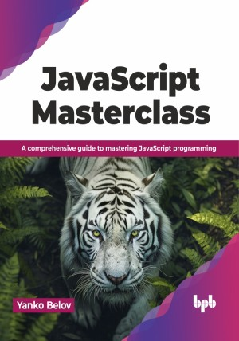

# JavaScript Masterclass

Master the world's most dominant programming language

This is the repository for [JavaScript Masterclass
](https://bpbonline.com/products/javascript-masterclass),published by BPB Publications.

## About the Book
JavaScript Masterclass is your comprehensive guide to mastering the most used language of the web. This book enables you to build dynamic websites, create interactive experiences, and level up your web development skills by taking you on a journey through the world of JavaScript.

Starting with the basics, you will explore JavaScript's syntax, data types, and control structures. Learn about the latest language features in ES2022, object-oriented programming, and asynchronous programming. Dive deep into functions, closures, and modules, and gain a solid understanding of the often-tricky 'this' keyword. Discover the power of coercion. Explore advanced object concepts and how to work with popular frameworks like React and Vue. Test and debug your code effectively and optimize it for performance. Finally, go beyond tools and extensions to learn about code optimization, tool selection, collaboration, and emerging trends in JavaScript development. 

Whether you are a beginner or an experienced developer, this book equips you with the knowledge and skills to become a JavaScript master.

## What You Will Learn
• Master JavaScript's core concepts, syntax, and data types.

• Apply the latest ES2022 features for more efficient coding.

• Tackle complex challenges with OOPs principles and asynchronous techniques.

• Create modular and maintainable code with closures and modules.

• Build real-world projects using popular frameworks like React and Vue.
